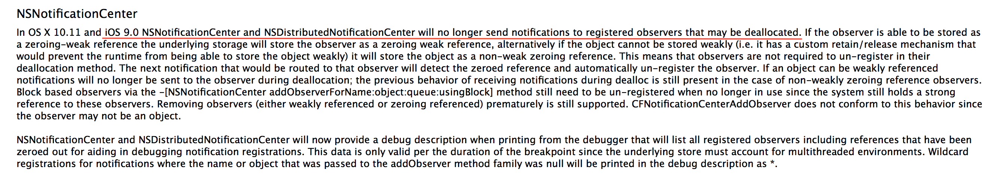

# MSNotificationProtector

No intrusive automatic removal of notifications added below iOS9

[https://developer.apple.com/library/archive/releasenotes/Foundation/RN-FoundationOlderNotes/index.html#10_11NotificationCenter](https://developer.apple.com/library/archive/releasenotes/Foundation/RN-FoundationOlderNotes/index.html#10_11NotificationCenter)

## Installation

### Cocoapods(Recommended)

1. Add `pod 'MSNotificationProtector'` to your Podfile.
2. Run `pod install`

### Manual

1. Add all files under `MSNotificationProtector` to your project

## Requirements

- iOS 2.0 and greater
- ARC/MRC

## How To Use
Automatically effective, no additional operations are required after the project is introduced

## License

MSCrashProtector is available under the MIT license. See the LICENSE file for more info.

